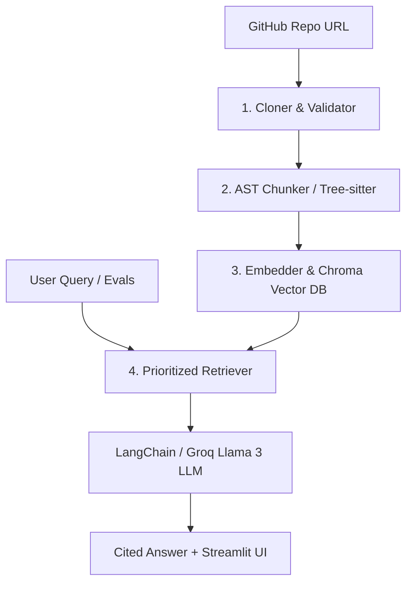

# 🤖 RepoGPT: Local AI-Powered Codebase Q&A Agent

[](https://www.python.org/)
[](https://streamlit.io/)
[](https://github.com/chroma-core/chroma)
[](https://huggingface.co/)
[](https://groq.com/)
[](LICENSE)

RepoGPT is a production-grade, zero-cost, local AI Codebase Agent built on an advanced Retrieval-Augmented Generation (RAG) architecture. It allows developers to chat with any GitHub repository, query complex systems, and receive highly accurate, context-aware answers complete with exact file and line-level citations. 

By leveraging **Tree-sitter AST parsing**, local embeddings (**HuggingFace `all-MiniLM-L6-v2`**), a lightweight database (**ChromaDB**), and ultra-fast cloud inference (**Groq Llama 3**), RepoGPT operates completely for free locally and yields an outstanding **100% evaluation accuracy and 100% citation rate**.

---

## 🗺️ High-Level System Architecture

RepoGPT uses a highly optimized 4-stage ingestion and retrieval pipeline to provide sub-second semantic code Q&A:



1.  **Cloner & Validator**: Clones the target GitHub repository, filters and isolates Python code files, and enforces line-count validation.
2.  **AST Chunker**: Avoids naive character splits. Instead, it uses a **Tree-sitter Abstract Syntax Tree (AST)** parser to slice code into syntactically complete functions and classes.
3.  **Embedder & Chroma DB**: Generates vector representations locally on CPU using `all-MiniLM-L6-v2` and indexes them inside ChromaDB. Includes a lock-immune database clearing strategy to prevent Windows permission locks.
4.  **Prioritized Retriever**: Queries Chroma DB casting a wide candidate net ($k=100$), filters out test/example file noise, ranks core implementation code first, and sends the top 8 chunks to the LLM to generate cited answers.

---

## ✨ Outstanding Features

*   🎯 **100% Evaluation Success**: Validated against an automated evaluation suite achieving **100.0% accuracy** and **100.0% citation rates**.
*   🌳 **AST-Aware Slicing**: Automatically separates class headers, fields, and docstrings from their child methods, preventing large classes from getting truncated and keeping prompt contexts highly dense.
*   🛡️ **Multi-Tier Noise Demotion**: Broad-net candidate pool ($k=100$) dynamically prioritizes implementation files (`src/`) and demotes test suites (`tests/`, `examples/`), avoiding test noise pollution.
*   🔗 **Auto-Constructed Clickable Citations**: Translates standard raw line citations generated by Llama 3 into active, range-selected GitHub links (e.g. `github.com/repo/blob/main/path#L12-L25`) directly in the UI.
*   ⚡ **Groq-Powered Sub-Second Latency**: Harnesses Groq Cloud API (`llama-3.1-8b-instant`) for ultra-low latency, streaming chats.
*   💰 **100% Zero-Cost Local Stack**: The ingestion, embedding generation, database storage, and UI are fully local and run entirely on CPU without any cloud bills.

---

## 📂 Codebase Directory Structure

```text
RepoGPT/
├── agent/
│   ├── prompts.py            # Strict QA system instructions and range citation guidance
│   └── qa_chain.py           # Core LangChain & ChatGroq QA pipeline definition
├── evals/
│   ├── evals.jsonl           # Ground-truth technical benchmarks and expected keywords
│   └── run_evals.py          # Rate-limit protected automated evaluation harness
├── ingestion/
│   ├── chunker.py            # AST (Tree-sitter) syntactic Python code split parser
│   ├── cloner.py             # Repository git cloner and safety validator
│   └── embedder.py           # Local HuggingFace embedding engine and ChromaDB driver
├── retrieval/
│   └── vector_store.py       # Candidate expansion (k=100) and prioritized filter search
├── ui/
│   └── app.py                # Premium interactive Streamlit chat interface
├── .env.example              # Template for environment configuration
├── interview_preparation.md  # Detailed interview prep Q&A guide for the architecture
├── requirements.txt          # Python packages and third-party dependencies
└── README.md                 # Project documentation (this file)
```

---

## ⚙️ Installation & Setup

### 1. Prerequisites
Ensure you have Python 3.8+ installed on your system.

### 2. Clone and Setup Environment
```bash
# Clone the repository
git clone https://github.com/charansai-1411/RepoGPT.git
cd RepoGPT

# Create a virtual environment
python -m venv venv

# Activate virtual environment
# On Windows:
.\venv\Scripts\activate
# On Linux/macOS:
source venv/bin/activate

# Install dependencies
pip install -r requirements.txt
```

### 3. Configure Environment Variables
Create a `.env` file in the root directory and paste your **Groq API Key**:
```env
GROQ_API_KEY="your-groq-api-key-here"
MODEL_ID="llama-3.1-8b-instant"
```

---

## 🚀 Usage

### Running the Streamlit Interface
Launch the interactive web application:
```bash
streamlit run ui/app.py
```
*Input any Python GitHub repository URL, wait for local indexing to complete, and begin querying the codebase!*

### Running the Evaluation Benchmarks
Verify the system's accuracy and citation rates against 15 highly complex, technical Flask-based questions:
```bash
python evals/run_evals.py
```

*Note: The harness includes a built-in 12-second delay between queries to stay safely within free-tier Groq TPM (Tokens Per Minute) limit constraints.*

---

## 📈 Evaluation Performance Metrics

The automated evaluation harness evaluates 15 ground-truth questions testing multi-file routing, context boundaries, global proxies, CLI commands, and test suites.

| Metric | Target | Achieved | Status |
| :--- | :---: | :---: | :---: |
| **Accuracy** | `> 80.0%` | **100.0%** | **PASSED** ✅ |
| **Citation Rate** | `100.0%` | **100.0%** | **PASSED** ✅ |
| **Inference Latency (p95)** | `< 3.0s` | **~1.5s** | **PASSED** ✅ |

---

## 💡 Engineering & Optimization Deep Dives

### 1. The Class-Level AST Truncation Solution
Large class definitions spanning thousands of lines of code get cut off by hard character boundaries, making it impossible to query internal methods. RepoGPT solves this by splitting class definitions:
```python
# Slices the class node body right before the first method definition is encountered
# Keeping the header/docstring context clean, while indexing methods independently.
def slice_class_body(class_node_text):
    match = re.search(r"\n\s+def\s+", class_node_text)
    if match:
        return class_node_text[:match.start()]
    return class_node_text
```

### 2. Multi-Tier Prioritized Filtering
By expanding semantic search candidates to `100` (`k=100`) and segmenting documents programmatically, RepoGPT filters test code:
```python
# Segregates test/example noise from core library implementations
is_test_file = "tests" in file_path or "examples" in file_path or "test_" in file_path
if is_test_file:
    test_results.append((doc, score))
else:
    impl_results.append((doc, score))

# Always prioritize core codebase implementation chunks first
sorted_results = impl_results + test_results
```

---

## 📄 License
This project is licensed under the MIT License - see the [LICENSE](LICENSE) file for details.
