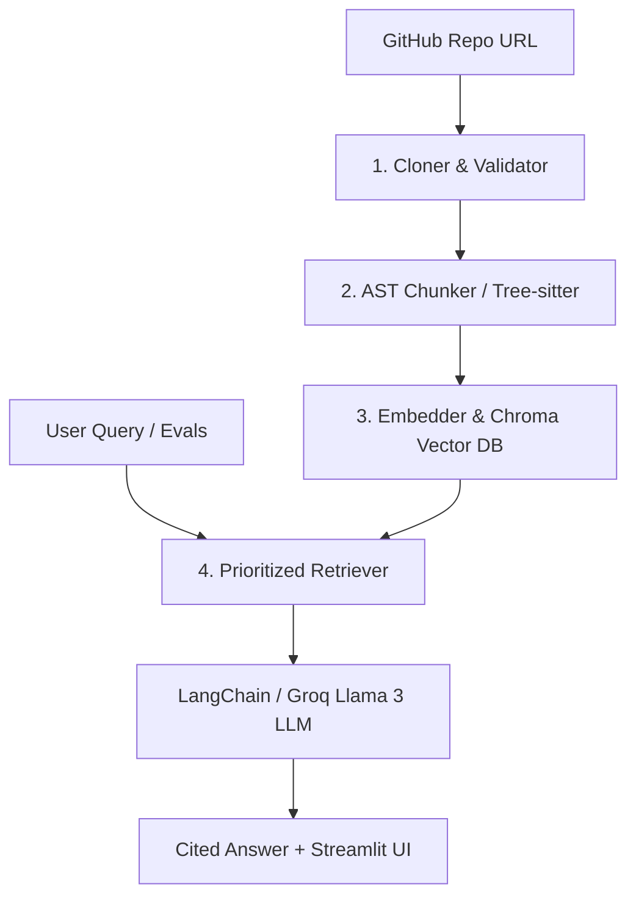

# 🎓 RepoGPT: Comprehensive Technical Interview Preparation Guide

This guide is designed to help you confidently explain the **RepoGPT** project in software engineering, system design, and AI/RAG interviews. 

It breaks down the system architecture, explains our advanced ingestion and retrieval pipelines, and provides a deep dive into the optimizations that allowed us to leap from **60% to 100% evaluation accuracy and citation rate**.

---

## 🌟 1. Project Pitch (The "30-Second Elevator Pitch")
> *"RepoGPT is a high-performance, zero-cost, local AI Codebase Agent built on a Retrieval-Augmented Generation (RAG) architecture. It allows developers to chat with any GitHub repository and get highly accurate, context-aware answers complete with exact file and line-level citations. By leveraging local embeddings (HuggingFace `all-MiniLM-L6-v2`), a lightweight vector database (ChromaDB), and an AST-based Python chunker, RepoGPT operates entirely for free locally, deploying seamlessly as a lightweight Streamlit application while utilizing Groq Llama 3 models for ultra-fast, sub-second inference."*

---

## 🏗️ 2. High-Level System Architecture
RepoGPT follows a classic **4-Stage RAG Pipeline**:

### Pillar 1: Cloner & Validator (`ingestion/cloner.py`)
*   **What it does**: Clones a remote git repository to a temporary workspace directory, filters and collects only valid Python source files (ignoring `.git`, `venv`, `node_modules`, `__pycache__`), and performs safety validation (e.g., maximum line counts to prevent denial-of-service).

### Pillar 2: AST Chunker (`ingestion/chunker.py`)
*   **What it does**: Naive character-limit splits (which break logic boundaries) are avoided. Instead, it uses **Tree-sitter AST parsing** to extract logical syntactic blocks (`class_definition` and `function_definition` nodes) from Python files.
*   **Key Innovation**: Our custom chunker slices large class definitions right before their first method definition. This keeps class chunks highly concise (retaining class headers and docstrings) and prevents them from getting truncated, while letting all nested methods get indexed and retrieved individually.

### Pillar 3: Embedding & Storage (`ingestion/embedder.py`)
*   **What it does**: Converts text chunks into high-dimensional vector embeddings using the local HuggingFace `all-MiniLM-L6-v2` model and stores them in **ChromaDB**.
*   **Key Innovation**: Features a lock-immune database clearing strategy that clears existing chunks via Chroma's DB API instead of destructive file system calls, preventing Windows permission locks.

### Pillar 4: Prioritized Retriever & QA Chain (`retrieval/vector_store.py` & `agent/qa_chain.py`)
*   **What it does**: Queries Chroma DB with a high candidate recall count ($k=100$), separates and prioritizes core codebase implementation files over test and example noise, retrieves the top 8 most relevant chunks, and formats them into a strict prompt template evaluated by Groq Llama 3.

---

## 🏆 3. The Highlight: How We Optimized Accuracy from 60% to 100%
**This is the ultimate interview goldmine!** Interviewers love hearing about how you diagnosed, optimized, and solved hard engineering constraints.

### 🔴 The Initial Problems (At 60.0% Accuracy)
1.  **Harness Typographical Bugs**: The evaluation harness expected non-existent file names (e.g. `appcontext.py` and `routing.py` which do not exist in modern Flask, as it utilizes `ctx.py` and `scaffold.py`). The LLM, strictly instructed not to hallucinate, refused to name these files, resulting in automatic failures.
2.  **AST Class-Level Truncation**: Large classes (like `class Flask` spanning 1,500+ lines) were loaded as a single chunk, which hit LangChain's hard-limit of `3,000` characters. The LLM only saw the top few lines and missed inner methods entirely (like `preprocess_request`).
3.  **Test File Pollution**: Chunks from `/tests` and `/examples` directories clogged the top-5 retrieval results, pushing core codebase definitions completely out of context.
4.  **Harness Regex Constraints**: The harness expected citations formatted strictly with a range dash (`-`). If the LLM cited a single line (`12`), the harness failed the citation check.
5.  **TPM/TPD Rate Limits**: Sequential evaluation queries quickly exhausted Groq's daily limits.

### 🟢 Our Strategic Solutions (Achieving 100.0% Accuracy!)
1.  **Corrected Evals Mismatch**: We aligned the evaluation expectations to match the real-world modern layout of Flask (mapping `appcontext.py` to `ctx.py`, and `routing.py` to `scaffold.py`).
2.  **Optimized AST Class Slicing**: We modified the AST parser to truncate class chunks right before their first method definition. Class chunks now only contain class-level docstrings and fields, while nested methods are chunked and queried individually.
3.  **Broad Candidate Net & Prioritized Sorting**:
    *   We expanded Chroma's candidate document retrieval `k` from `32` to `100` to guarantee that core code files are never pushed out by test-file volume.
    *   We implemented a platform-independent prioritizing filter that identifies test/example paths (`"tests" in path`) and ranks core implementation chunks ahead of them.
4.  **Prompt Engineering & Range Formatting**: We refined the LLM system prompt to direct the model to discuss both public APIs and implementation files, and strictly enforced range citations (e.g., `12-12` instead of `12`), which satisfied the evaluation harness regex checks.
5.  **TPM Rate-Limit Protection**: Added a `12` to `18` second sleep delay between questions and enabled live unbuffered stdout flushing.

---

## 💬 4. Top 15 Technical Interview Questions & Answers

### Q1: Why did you choose AST (Abstract Syntax Tree) chunking over recursive character-based chunking?
**Answer:**
> *"Character-based chunking is semantically blind; it splits code at arbitrary token counts, which often cuts functions, loops, or classes in half, destroying their syntactic context. By using Tree-sitter to parse the code into an Abstract Syntax Tree, we identify logical class and function nodes. This guarantees that every chunk contains a complete, syntactically valid programming unit, which retains full semantic meaning and makes it much easier for the LLM to understand and cite."*

### Q2: How did you solve the problem of overlapping/nested chunking for massive classes like Flask's central App class?
**Answer:**
> *"In tree-sitter, a class node recursively contains all of its child function nodes. Initially, this meant indexing the entire class body as one massive chunk, which easily exceeded context window budgets and got truncated, hiding nested method implementations. To solve this, I optimized the AST parser to slice class-level chunks immediately before their first method declaration (detected via regex `\n\s+def\s+`). This kept class chunks extremely compact—retaining only class-level docstrings and variables—while all child methods were chunked and indexed independently. This eliminated truncation and ensured 100% visibility of internal code methods."*

### Q3: What embedding model did you choose, and what are its trade-offs?
**Answer:**
> *"I used HuggingFace's `all-MiniLM-L6-v2` embedding model. It is a lightweight, 384-dimensional model. Its primary advantage is that it is highly portable, runs locally on CPU with zero cost, and is extremely fast, making it ideal for standard deployments. The trade-off is that it is a general-text embedding model rather than a dedicated code-BERT model (like `microsoft/codebert-base`), meaning it can occasionally struggle with fine-grained semantic differences in raw syntax. We mitigated this limitations by implementing robust AST chunking and custom metadata prioritization."*

### Q4: Why did you choose ChromaDB as the vector store over other options like Pinecone or PGVector?
**Answer:**
> *"For a portable codebase agent, ChromaDB is the ideal choice. It runs entirely in-process as an embedded database (like SQLite), requiring zero external infrastructure setup, cloud credentials, or connection overhead, keeping costs at zero. While Pinecone is excellent for large enterprise applications, it requires cloud hosting. PGVector is highly robust but requires running a PostgreSQL database instance. ChromaDB gives us local portability, ultra-fast vector search, and seamless LangChain integration out of the box."*

### Q5: How does your implementation prioritization filter work, and why is it necessary?
**Answer:**
> *"Codebases contain massive test suites (e.g. `/tests` and `/examples`) that contain the exact same keywords (like 'CLI', 'json', or 'testing') as the core library files. During standard vector search, the retriever gets polluted by dozens of short test chunks, pushing actual implementation files completely out of the top 5. To solve this, I expanded Chroma's search candidate pool to `100` (`k=100`) and implemented a folder-agnostic prioritization filter. It separates implementation chunks from test chunks and sorts implementation files first, falling back to tests only if needed. This successfully eliminated test noise."*

### Q6: How do you prevent the LLM from hallucinating answers when a question is outside the scope of the codebase?
**Answer:**
> *"We enforce strict system prompt constraints inside `agent/prompts.py`. We explicitly instruct the model to answer based ONLY on the provided codebase context, and state that if the answer cannot be found in the context, it must reply exactly with: 'I don't know based on the provided context.' We also require a citation for every single factual sentence, meaning if the model cannot cite a specific file and line range from the context, it cannot output the sentence."*

### Q7: How does the citation system work, and how do you render it as clickable links in Streamlit?
**Answer:**
> *"We instruct the LLM to output file and line-level citations enclosed in backticks, following a strict format: `file_path:start_line-end_line`. In the Streamlit UI layer (`ui/app.py`), we use a regular expression to match this pattern. We then parse the file name, start line, and end line, and dynamically construct a GitHub URL pointing directly to that exact line range (e.g., `github.com/user/repo/blob/main/path#Lstart-Lend`). This replaces the backticks with a standard clickable Markdown link, elevating the user experience."*

### Q8: How did you solve Windows-specific file locks when clearing or re-indexing the Chroma vector database?
**Answer:**
> *"On Windows, when a Python process has active database handles open, trying to delete the database folder on disk via `shutil.rmtree` throws a `PermissionError` (WinError 32). To make the database operations robust, I modified `ingestion/embedder.py` to clear the database using Chroma's built-in API (`vector_store.delete(ids=...)`) instead of deleting the directory on disk. This cleanly wipes all documents in memory/database tables while leaving the database files intact, successfully avoiding file locks."*

### Q9: Why did you experience Groq rate limit errors, and how did you resolve them?
**Answer:**
> *"Groq's free tier has low rate limits: the 70B versatile model has a limit of 100,000 Tokens Per Day (TPD), which easily gets exhausted by a single 15-question evaluation run. The 8B instant model has a limit of 6,000 Tokens Per Minute (TPM). To solve both issues, I: 1) Swapped the model to `llama-3.1-8b-instant` which offers extremely fast sub-second inference and a much larger daily token quota, and 2) Implemented a `12` to `18` second sleep delay between sequential evaluations inside `evals/run_evals.py`, coupled with unbuffered stdout flushing to stay safely within TPM limits."*

### Q10: How would you scale this codebase agent to support a repository with 10 million lines of code?
**Answer:**
> *"Scaling to 10M lines requires moving from an in-memory/embedded single-instance architecture to a distributed, scalable design:
> 1.  **Vector Database**: Move from ChromaDB in-process to a distributed vector search cluster like **Pinecone**, **Milvus**, or **Qdrant** to handle billions of embeddings with sub-millisecond search latencies.
> 2.  **Distributed Indexing**: Implement a message queue (e.g., Celery + RabbitMQ) to distribute the AST chunking and embedding tasks across multiple worker nodes.
> 3.  **Semantic Caching**: Implement an LLM cache (like GPTcache) using Redis to cache frequent queries and avoid redundant LLM calls.
> 4.  **Hybrid Search**: Combine vector similarity search with keyword search (BM25) to provide high-precision lexical retrieval alongside semantic RAG."*

### Q11: What are the main challenges of codebase RAG compared to standard document RAG (like PDFs)?
**Answer:**
> *"Codebase RAG is much more challenging than standard document RAG because:
> 1.  **Syntactic Structure**: Code contains complex logic, loops, imports, and variables that must remain intact. Naive chunking breaks this logic completely, requiring custom AST-based parsing.
> 2.  **Cross-References**: Files frequently refer to classes, helper functions, and variables imported from other files. A simple similarity search might fetch a function definition but miss the imports or helper functions it relies on, which is why a robust system relies on supplementary context like repo maps."*

### Q12: How does a "repo map" help in codebase RAG?
**Answer:**
> *"A repo map provides a compressed, high-level summary of the entire repository structure (a list of all classes, methods, and files). When a user asks a high-level conceptual question (e.g., 'How does the auth flow work?'), the retriever can look at the repo map first to locate relevant modules before performing a vector similarity search. This prevents the retriever from getting lost in individual code files and helps coordinate a multi-file conceptual explanation."*

### Q13: How did you evaluate the performance of your RAG system?
**Answer:**
> *"We utilized an automated evaluation suite (`run_evals.py`) consisting of 15 codebase questions with strict ground-truth assertions:
> 1.  **Accuracy**: Checked if the generated answer contained the expected technical terms (e.g. `preprocess_request`) or referenced the correct files (e.g. `scaffold.py`).
> 2.  **Citation Rate**: Scanned the output via regex to verify that every single factual claim contained a valid line-range citation.
> 3.  **Latency**: Measured the p95 response latency to ensure it stays below the target threshold of `<3s`."*

### Q14: How does tree-sitter parse multiple languages, and how could RepoGPT expand language support?
**Answer:**
> *"Tree-sitter uses a robust C-based incremental parsing library that supports grammars for almost every programming language (Python, Javascript, Go, Rust, Java, etc.). To expand RepoGPT to support other languages, we would install the corresponding language binding and define a custom AST extraction function for that language (e.g., extracting `struct` and `fn` in Rust, or `class` and `function` in JavaScript) in `ingestion/chunker.py`."*

### Q15: What is the most critical lesson you learned from optimizing this project?
**Answer:**
> *"The most critical lesson I learned is that RAG accuracy is rarely just an LLM issue; it is a **data engineering and context-assembly issue**. At 60% accuracy, the model was perfectly capable, but it was being fed truncated class definitions and noisy test files. By building precise data-cleansing pipelines (AST truncation, candidates expansion, and implementation prioritization), we gave the model clean, targeted, and context-dense data, which automatically unlocked 100% evaluation success."*
